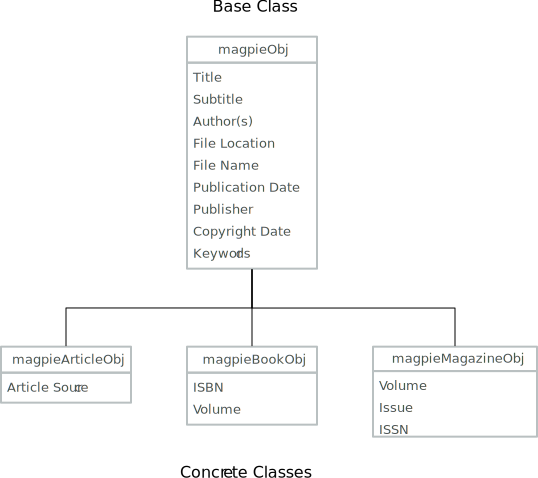

# Analysis

This document provides the system analysis of the MCMS.

## Definitions

- **Administrator** - an object representing a person with system management privileges
- **Article** - an object that represents an article (PDF format)
- **Book** - an object that represents an eBook (PDF or ePub format)
- **Magazine** - an object that represents an electronic magazine (PDF or ePub format)
- **User** - an object representing a person with the privleges to search or read articles, books, or magazines managed by the MCMS

### Article Analysis

An article is contained in a single PDF file that can be downloaded or viewed. Each article should have the following "metadata":

- Title
- Subtitle
- Author(s)
- File location
- File name
- Publication Date
- Article Source
- Copyright date
- Keywords

In some cases it is likely that all of the above metadata may not be available and in those cases the metadata item will either not exist or have a value of null/undefined.

### Book Analysis

A book is contained in a single file in PDF or ePub format\* Each book should have the following metadata:

- Title
- Subtitle
- Author(s)
- File location
- File name
- Publication Date
- Publisher
- Copyright date
- ISBN
- Keywords

As with articles, any metadata items that are not available should have a value of null/undefined.

### Magazine Analysis

A magazine is contained in a single file in PDF format\* Each magazine should have the following metadata:

- Title
- Subtitle
- Author(s)
- File location
- File name
- Publication Date
- Publisher
- Volume
- Issue
- Copyright date
- ISSN
- Keywords

As with articles, any metadata items that are not available should have a value of null/undefined.

### Data Models

From the above we can see that there are several properties that the different types have in common:

- Title
- Subtitle
- Author(s)
- File Location
- File Name
- Publication Date
- Publisher
- Copyright Date
- Keywords

With this being the case, it makes sense to create a base model and specialize the model for each type of document managed by adding the relevant properties.

  

    
  

When creating the metadata object models, it is likely that many of the properties will potentially have the same values and to avoid inconsistencies in spelling due to updates, it seems reasonable to abstract these properties as their own collection objects. The following attributes are candidates for being part of an collection object:

- Author
- Publisher
- Keywords

An inherent assumption is that each of the document objects will receive a unique id and that the subordinate collections (author, publisher, keyword) likewise are assigned a unique id for each item. This allows the creation of "intersection" objects that contain the ids of a document and the relevant subordinate object (author/publisher/keyword) to assist with data consistency when stored in a relational data store.
