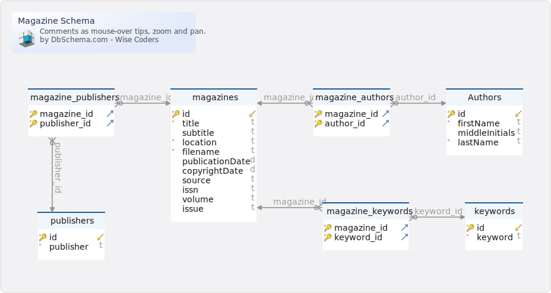

#Magazine Schema
Generated using [DbSchema](https://dbschema.com)

### Magazine Schema

### Entity INSTANCE.Authors 
The authors entity contains information related to a particular author.

| | | | |
|---|---|---|---|
| * &#128273;  &#11019; | id| BIGINT  | Author id attribute - unique key |
| * | firstName| VARCHAR(100)  |  |
|  | middleInitials| VARCHAR(16)  |  |
| * | lastName| VARCHAR(100)  |  |

##### Indexes 
| | | |
|---|---|---|
| &#128273;  | pk\_Authors | ON id|

### Entity INSTANCE.keywords 
| | | |
|---|---|---|
| * &#128273;  &#11019; | id| BIGINT  |
| * | keyword| VARCHAR(100)  |

##### Indexes 
| | | |
|---|---|---|
| &#128273;  | pk\_keywords | ON id|

### Entity INSTANCE.magazine_authors 
| | | | |
|---|---|---|---|
| * &#128273;  &#11016; | magazine\_id| BIGINT  |  |
| * &#128273;  &#11016; | author\_id| BIGINT  | Author id attribute - unique key |

##### Indexes 
| | | |
|---|---|---|
| &#128273;  | pk | ON magazine\_id, author\_id|

##### Relationships
| | | |
|---|---|---|
|  | fk_magazine_authors_magazines | ( magazine\_id ) ref [INSTANCE.magazines](#magazines) (id) |
|  | fk_magazine_authors_Authors | ( author\_id ) ref [INSTANCE.Authors](#Authors) (id) |

### Entity INSTANCE.magazine_keywords 
| | | |
|---|---|---|
| * &#128273;  &#11016; | magazine\_id| BIGINT  |
| * &#128273;  &#11016; | keyword\_id| BIGINT  |

##### Indexes 
| | | |
|---|---|---|
| &#128273;  | pk | ON magazine\_id, keyword\_id|

##### Relationships
| | | |
|---|---|---|
|  | fk_magazine_keywords_magazines | ( magazine\_id ) ref [INSTANCE.magazines](#magazines) (id) |
|  | fk_magazine_keywords_keywords | ( keyword\_id ) ref [INSTANCE.keywords](#keywords) (id) |

### Entity INSTANCE.magazine_publishers 
| | | |
|---|---|---|
| * &#128273;  &#11016; | magazine\_id| BIGINT  |
| * &#128273;  &#11016; | publisher\_id| BIGINT  |

##### Indexes 
| | | |
|---|---|---|
| &#128273;  | pk | ON magazine\_id, publisher\_id|

##### Relationships
| | | |
|---|---|---|
|  | fk_magazine_publishers_magazines | ( magazine\_id ) ref [INSTANCE.magazines](#magazines) (id) |
|  | fk_magazine_publishers_publishers | ( publisher\_id ) ref [INSTANCE.publishers](#publishers) (id) |

### Entity INSTANCE.magazines 
| | | |
|---|---|---|
| * &#128273;  &#11019; | id| BIGINT  |
| * | title| VARCHAR(100)  |
|  | subtitle| VARCHAR(100)  |
| * | location| VARCHAR(256)  |
| * | filename| VARCHAR(100)  |
|  | publicationDate| DATE  |
|  | copyrightDate| DATE  |
|  | source| VARCHAR(256)  |
|  | issn| VARCHAR(32)  |
|  | volume| VARCHAR(32)  |
|  | issue| VARCHAR(32)  |

##### Indexes 
| | | |
|---|---|---|
| &#128273;  | pk\_articles\_1 | ON id|

### Entity INSTANCE.publishers 
| | | |
|---|---|---|
| * &#128273;  &#11019; | id| BIGINT  |
| * | publisher| VARCHAR(100)  |

##### Indexes 
| | | |
|---|---|---|
| &#128273;  | pk\_publishers | ON id|

